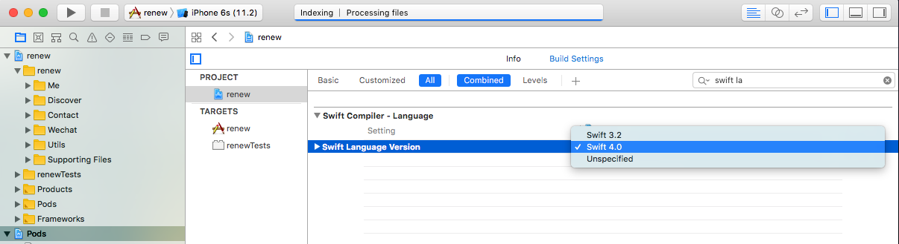
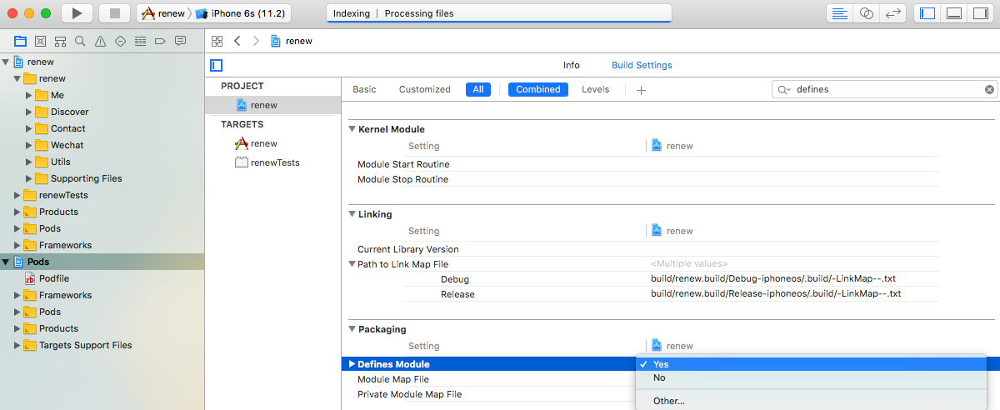
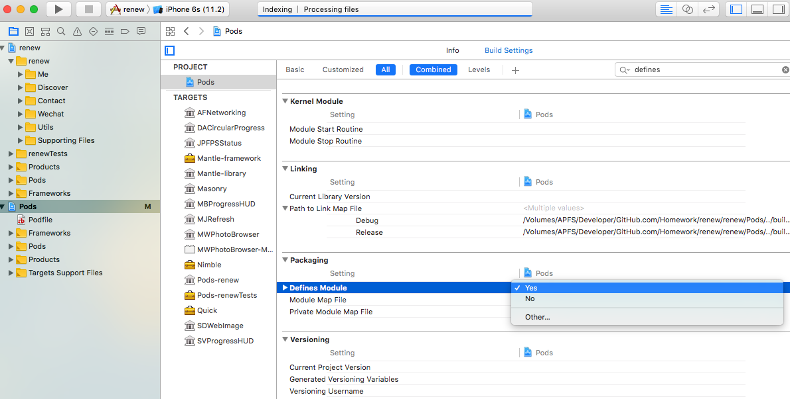
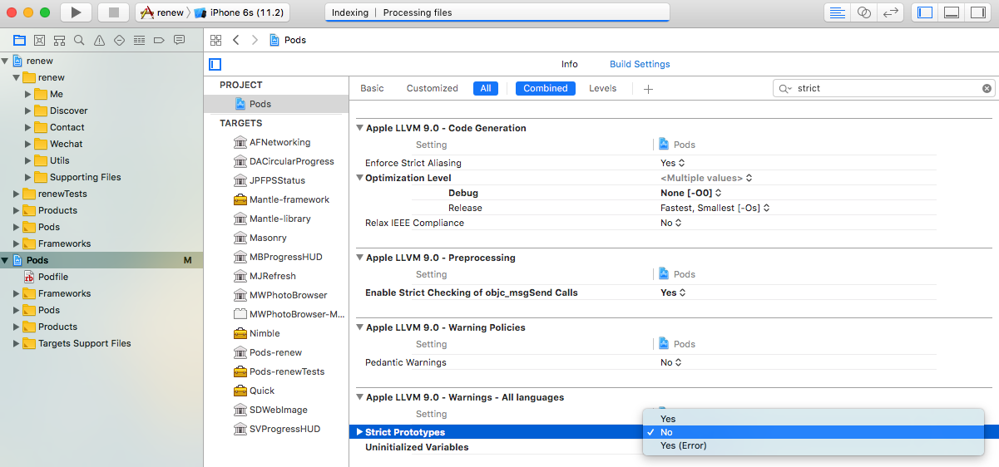
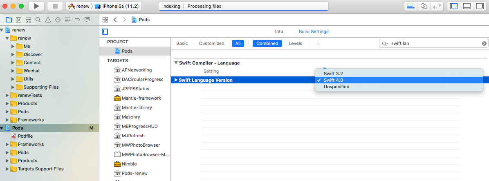
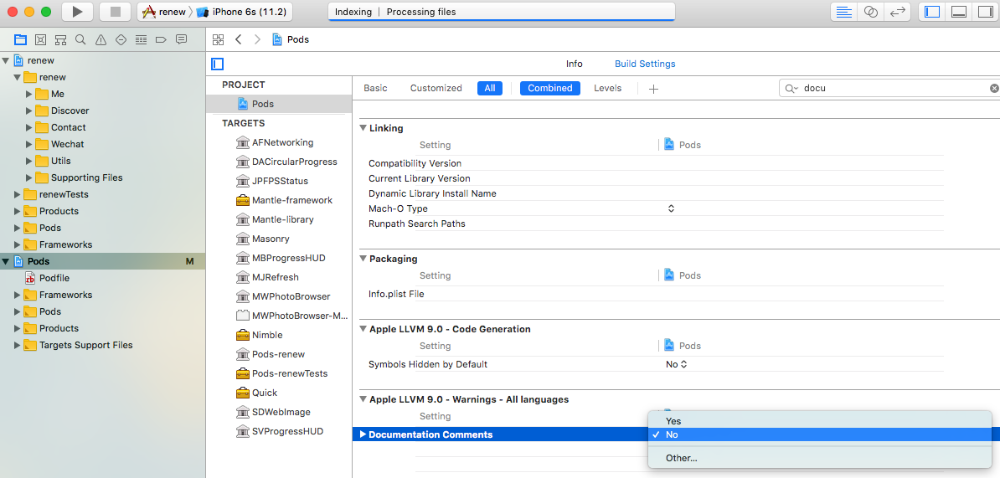

# Renew  
&nbsp;&nbsp;&nbsp;&nbsp; It is a wechat like demo with unit testcase. And all UI pages come from native NSConstrains, native Anchor, open-source Masonry. Quick + Nimble for UnitTestCase. The only one important thing should be attentioned is that you must create at least one swift-file in the project if you're gonna use Quick+Nimble for Objective-C programming.  

* project settings  

  

  
. 

* cocoaPods settings  

  

  

  

  
.   

* review   
[review video](./res/renew.mov)

